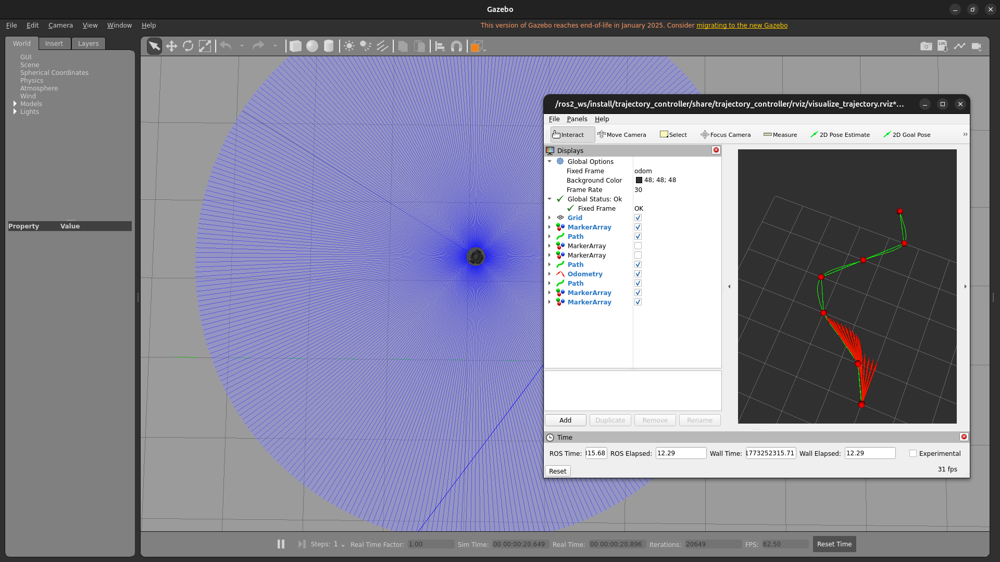
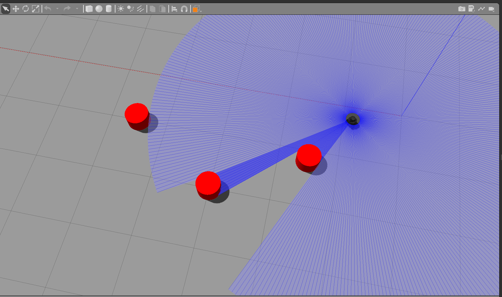
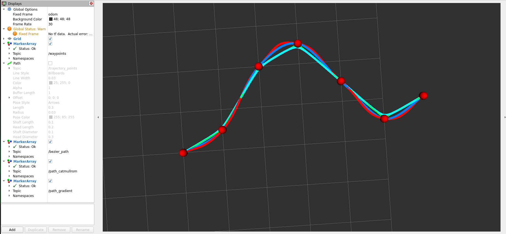

# trajectory_control

ROS2 path smoothing and trajectory tracking for a Turtlebot3 Burger differential-drive robot, running in Gazebo Classic via Docker.

Implements three path smoothing algorithms (Catmull-Rom, Bezier, Gradient Descent), a trapezoidal velocity trajectory generator, a Pure Pursuit controller, and LiDAR-based obstacle detection — all visualised simultaneously in RViz2.

---

## Demo

```bash
git clone https://github.com/N1CKX-MU/trajectory_control.git
cd trajectory_control
xhost +local:docker
make docker        # starts container and drops you inside
make demo          # builds + launches everything
```

Gazebo opens with the Turtlebot3 in an obstacle course. RViz2 opens showing all three smooth paths, the reference trajectory, and the robot tracking it in real time.

---

## Environment

| Component | Version |
|-----------|---------|
| Host OS | Ubuntu 24.04 |
| Container OS | Ubuntu 22.04 (Jammy) |
| ROS2 | Humble |
| Gazebo | Classic 11 |
| Robot | Turtlebot3 Burger |
| GPU | Nvidia (passthrough via nvidia-container-toolkit) |

---

## Repository Structure

```
trajectory_control/
├── docker/
│   ├── Dockerfile          # ROS2 Humble + Gazebo Classic + TB3 + Nvidia GL
│   └── entrypoint.sh       # sources ROS2, sets env vars, auto builds workspace
├── docker-compose.yml      # Nvidia passthrough, X11 forwarding, src volume mount
├── Makefile                # host-side commands (docker up/down/build)
└── src/
    └── trajectory_controller/
        ├── CMakeLists.txt
        ├── package.xml
        ├── Makefile                        # container-side commands (build/demo/run)
        ├── config/
        │   └── params.yaml                 # all tunable parameters
        ├── include/trajectory_controller/
        │   ├── types.hpp                   # shared structs + waypoint loader
        |   └── viz_utils.hpp
        ├── msg/
        │   └── segment.msg
        ├── launch/
        │   ├── demo.launch.py              # full demo (Gazebo + all nodes + RViz2)
        │   ├── demo_with_obstacles.launch.py  # demo with obstacle avoidance
        │   └── graph_compare.launch.py     # smoother comparison (no Gazebo)
        ├── rviz/
        │   └── visualize_trajectory.rviz   # pre-configured RViz2 layout
        ├── src/
        │   ├── waypoints.cpp               # publishes waypoints as markers
        │   ├── catmull.cpp                 # Catmull-Rom smoother
        │   ├── bezier_node.cpp             # Cubic Bezier smoother
        │   ├── gradient_smoothing.cpp      # Gradient Descent smoother
        │   ├── trajectory_generator.cpp    # trapezoidal velocity profile
        │   ├── controller.cpp              # Pure Pursuit controller
        │   ├── obstacle_detector.cpp       # LiDAR clustering → obstacle positions
        │   └── obstacle_avoider.cpp        # path deformation around obstacles
        ├── test/
        │   └──test_smoother.cpp
        └── worlds/
            └── obstacle_course.world       # Gazebo world with cylindrical obstacles
```

---

## Quick Start

### Prerequisites

- Docker + Docker Compose
- Nvidia Container Toolkit (`nvidia-container-toolkit`)
- X11 display forwarding

### First time setup

```bash
# Build the Docker image
make docker-build

# Allow Docker to use your display
xhost +local:docker
```

### Running

```bash
# Start container (host terminal)
make docker

# Inside container — full demo
make demo

# Inside container — smoother comparison only (no Gazebo, no robot)
make graph_compare

# Inside container — demo with obstacle avoidance
make demo_obstacles
```

---

### Outputs 

```bash
make demo
```


```bash
make demo_obstacles
```



```bash
make graph_compare
```


## Troubleshooting

**Gazebo hangs on startup**
```bash
chmod 700 /tmp/runtime-root
export GAZEBO_MODEL_DATABASE_URI=""
export GAZEBO_MODEL_PATH=/usr/share/gazebo-11/models:/opt/ros/humble/share/turtlebot3_gazebo/models
```

**Robot falls through the ground**
Make sure `GAZEBO_MODEL_PATH` includes `/usr/share/gazebo-11/models` so the ground plane model is found.

**RViz2 shows no data**
Check fixed frame is set to `odom`. Run `make topics` to verify nodes are publishing.

**Controller prints "Waiting for avoided path..."**
Start `obstacle_detector_node` and `obstacle_avoider_node` before the controller. The controller waits until a valid path is received before moving.


---
